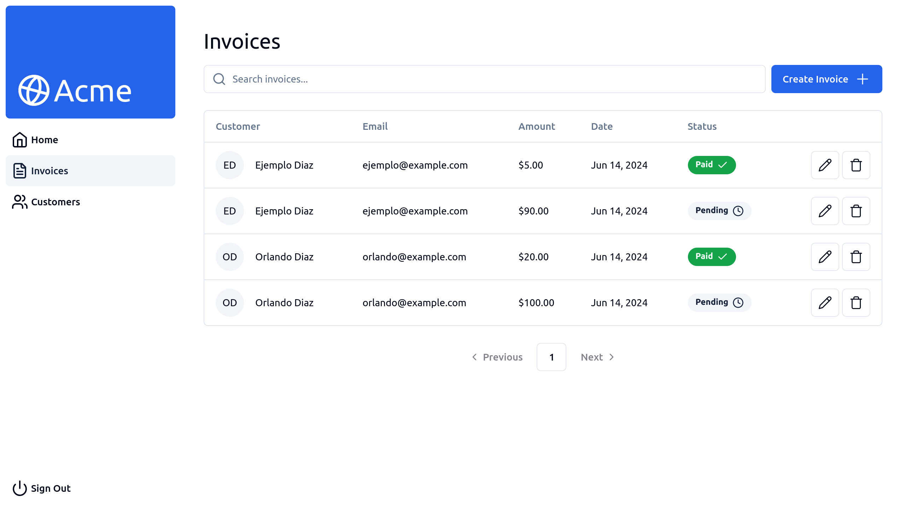
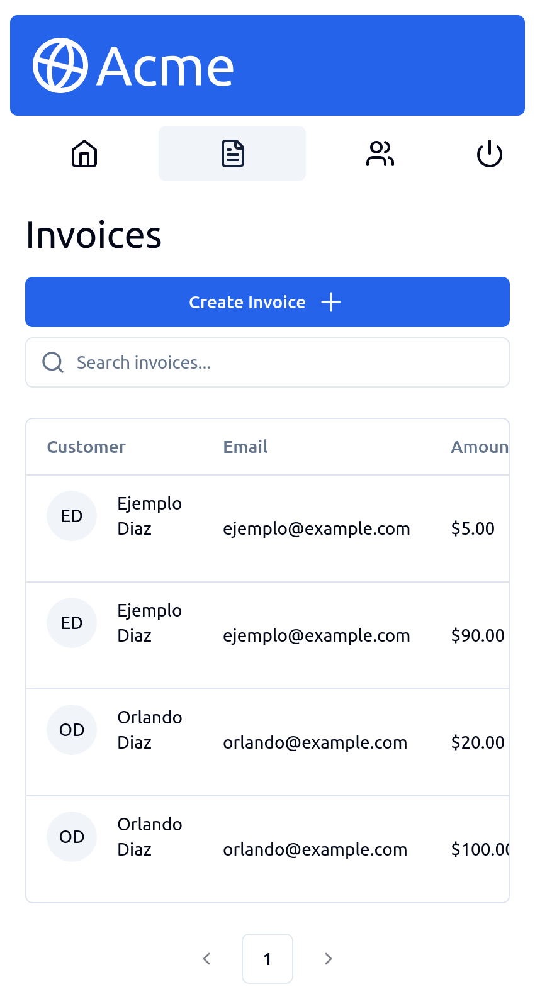

# Acme Dashboard <a name="about-project"></a>

**Acme** is a full-stack application designed to keep track of invoices. It's a clone of Next.js' Acme Dashboard.

[Live Site](https://acme.odiaz.com.co/)
[API Documentaion](https://acme.odiaz.com.co/api/docs/swagger-ui/index.html)


## Key Features <a name="key-features"></a>

- Login functionality (username: `admin@example.com`, password: `123456`)
- Users can create, update, and delete customer invoices
- Includes swagger docs built with `springdoc`

## Built With <a name="built-with"></a>

This project was created using:

### Backend

#### Server

- Spring Boot
- Spring Security
- Spring Data
- Java Bean Validation
- Springdoc

#### Database

- PostgreSQL

### Frontend

- TypeScript
- React
- Tanstack Router and Query
- TailwindCSS

## Screenshots

### Desktop



### Mobile



## Getting Started <a name="getting-started"></a>

Clone the repository into your machine (Or download the .zip file and extract).

```shell
git clone https://github.com/orlandodiazc/acme
```

To get a local copy up and running, you can either use docker or local development:

### Docker

#### Prerequisites

- [Install Docker](https://docs.docker.com/get-docker/)
- [Install Compose Plugin](https://docs.docker.com/compose/install/)

#### Usage

```shell
cd acme
docker compose up
```

### Local

#### Prerequisites

- Java 17 JDK ([Temurin](https://adoptium.net/temurin/releases/?version=17&package=jdk) and [SDKMAN](https://sdkman.io/install) are recommended)
- [PostgreSQL](https://www.postgresql.org/)
- [Node.js](https://nodejs.org/en/) ([Volta](https://volta.sh/) is recommended)
- [pnpm](https://pnpm.io/installation) or npm

#### Setup

You'll need to configure the user and password for the database in the [application properties](backend/src/main/resources/application.properties).

#### Usage

```shell
cd acme/backend
./mvnw spring-boot:run
cd ../frontend
pnpm install
pnpm dev
```

## Authors <a name="authors"></a>

👤 **Orlando Diaz**

- GitHub: [@orlandodiazc](https://github.com/orlandodiazc)
- LinkedIn: [Orlando Diaz Conde](www.linkedin.com/in/orlando-diaz-conde)

## ⭐️ Show your support <a name="support"></a>

Give a star if you like this project!

<!-- LICENSE -->

## 📝 License <a name="license"></a>

This project is [MIT](./LICENSE) licensed.
